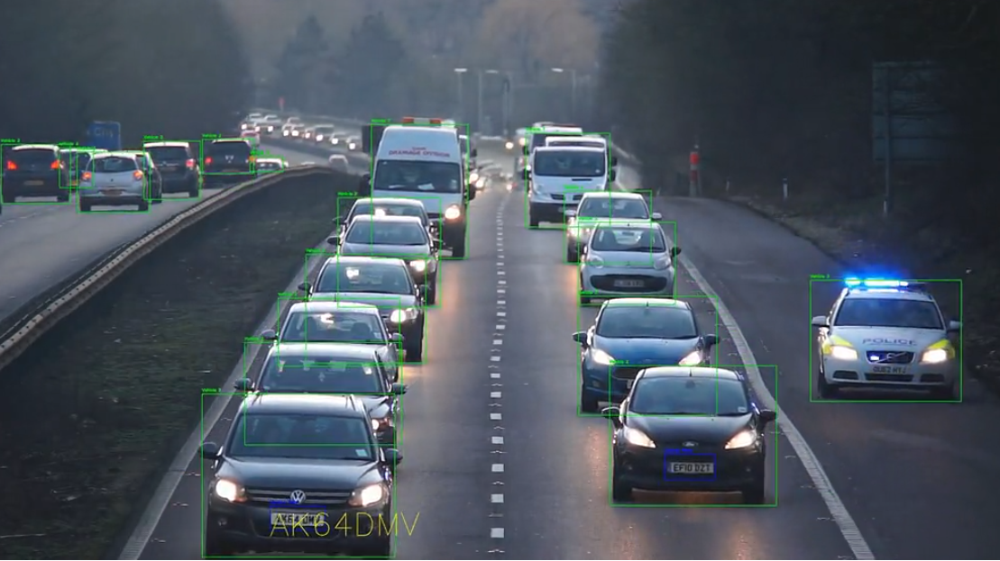

# automatic-number-plate-recognition-python-yolov8

    
     Watch the image example!

## data

The video I used in this tutorial can be downloaded [here](https://www.pexels.com/video/traffic-flow-in-the-highway-2103099/).

## models

A Yolov8 pretrained model was used to detect vehicles.

A licensed plate detector was used to detect license plates. The model was trained with Yolov8 using [this dataset](https://universe.roboflow.com/roboflow-universe-projects/license-plate-recognition-rxg4e/dataset/4) and following this [step by step tutorial on how to train an object detector with Yolov8 on your custom data](https://github.com/computervisioneng/train-yolov8-custom-dataset-step-by-step-guide). 

The trained model is available at https://github.com/Muhammad-Zeerak-Khan/Automatic-License-Plate-Recognition-using-YOLOv8/blob/main/license_plate_detector.pt

## dependencies

The sort module needs to be downloaded from [this repository](https://github.com/abewley/sort) as mentioned in the [video](https://youtu.be/fyJB1t0o0ms?t=1120).
